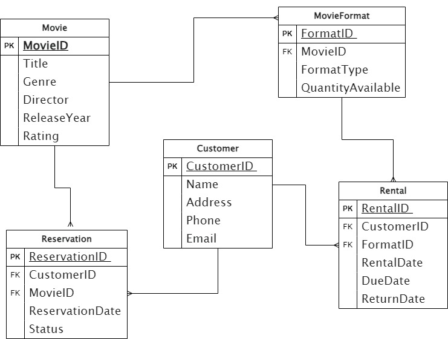

# RentalFlix

This project involves a database schema designed to manage a movie rental system. Below is an explanation of the key entities and their attributes in the database:

### Entities and Attributes

1. **Movie**
   - **MovieID (PK)**: A unique identifier for each movie.
   - **Title**: The title of the movie.
   - **Genre**: The genre or category of the movie (e.g., Action, Comedy, Drama).
   - **Director**: The director of the movie.
   - **ReleaseYear**: The year the movie was released.
   - **Rating**: The rating of the movie (e.g., PG, PG-13, R).

2. **MovieFormat**
   - **FormatID (PK)**: A unique identifier for each movie format.
   - **MovieID (FK)**: A foreign key that links to the MovieID in the Movie entity.
   - **FormatType**: The type of format (e.g., DVD, Blu-ray, Digital).
   - **QuantityAvailable**: The number of copies available for rent.

3. **Customer**
   - **CustomerID (PK)**: A unique identifier for each customer.
   - **Name**: The name of the customer.
   - **Address**: The address of the customer.
   - **Phone**: The contact phone number of the customer.
   - **Email**: The contact email address of the customer.

4. **Rental**
   - **RentalID (PK)**: A unique identifier for each rental record.
   - **CustomerID (FK)**: A foreign key that links to the CustomerID in the Customer entity.
   - **FormatID (FK)**: A foreign key that links to the FormatID in the MovieFormat entity.
   - **RentalDate**: The date when the movie was rented.
   - **DueDate**: The date when the movie is due to be returned.
   - **ReturnDate**: The date when the movie was returned (nullable).

5. **Reservation**
   - **ReservationID (PK)**: A unique identifier for each reservation.
   - **CustomerID (FK)**: A foreign key that links to the CustomerID in the Customer entity.
   - **MovieID (FK)**: A foreign key that links to the MovieID in the Movie entity.
   - **ReservationDate**: The date when the reservation was made.
   - **Status**: The status of the reservation (e.g., active, fulfilled, canceled).

### Relationships

- Each **Movie** can have multiple formats (e.g., DVD, Blu-ray), which is represented by the **MovieFormat** entity.
- Each **Customer** can rent multiple movies, which is tracked in the **Rental** entity.
- Each **Rental** is linked to a specific movie format through the **FormatID**.
- Each **Customer** can also make reservations for multiple movies, which is tracked in the **Reservation** entity.

This schema ensures that the movie rental system can efficiently manage the inventory, track rentals and reservations, and maintain customer information.

